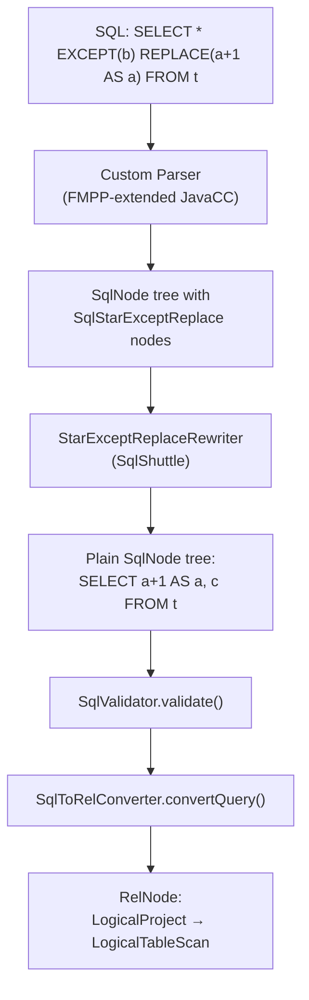

# SELECT * EXCEPT / REPLACE — Design Document

## Goal & Motivation

Extend the ANSI SQL Calcite engine behind the SQL endpoint to support BigQuery-style
`SELECT * EXCEPT(col, ...)` and `SELECT * REPLACE(expr AS col, ...)` syntax.

The motivation is to extend SQL semantics so that PPL commands like `rename`, `replace`,
`fillnull`, and `mvcombine` can all be represented as SQL relational operators. These
constructs provide a concise way to project "all columns minus some" or "all columns with
some replaced by expressions" — operations that are fundamental to the PPL-to-SQL
translation layer.

**Target syntax:**

```sql
-- Exclude columns
SELECT * EXCEPT(col1, col2) FROM t
SELECT t.* EXCEPT(col1) FROM t

-- Replace columns with expressions
SELECT * REPLACE(expr1 AS col1, expr2 AS col2) FROM t

-- Combined
SELECT * EXCEPT(a) REPLACE(b + 1 AS b) FROM t
```

## Scope

| In scope | Out of scope |
|----------|-------------|
| `SELECT * EXCEPT(...)` | `GROUP BY * EXCEPT(...)` |
| `SELECT * REPLACE(... AS ...)` | ANTLR-based SQL path changes |
| Qualified star: `t.* EXCEPT(...)` | PPL path changes |
| Combined EXCEPT + REPLACE | New RelNode types |
| Calcite ANSI_SQL path only | |

**Priority order:** SELECT * EXCEPT first, then SELECT * REPLACE.

## Background & Context

### Calcite does not support EXCEPT/REPLACE natively

Calcite 1.41.0's `SqlSelectKeyword` enum only contains `DISTINCT`, `ALL`, and `STREAM`.
The grammar defines `projectItem` as:

```
projectItem:
    expression [ [ AS ] columnAlias ]
  | tableAlias . *
```

There is no provision for `* EXCEPT(...)` or `* REPLACE(...)`. No version of Calcite
(through 1.42.0) has added this.

### Three SQL pipelines in the project

```
PPL path:
  query → PPLSyntaxParser → ANTLR → AstBuilder → UnresolvedPlan → CalciteRelNodeVisitor → RelNode

SQL path (ANTLR):
  query → SQLSyntaxParser → ANTLR → AstBuilder → UnresolvedPlan → CalciteRelNodeVisitor → RelNode

ANSI_SQL path (Calcite native):
  query → Calcite SqlParser → SqlNode → SqlValidator → SqlToRelConverter → RelNode
```

This design only modifies the **ANSI_SQL path**.

### Key existing code

| File | Role |
|------|------|
| `api/src/main/java/.../UnifiedQueryPlanner.java` | `planWithCalcite()` — the ANSI_SQL entry point |
| `api/src/main/java/.../UnifiedQueryContext.java` | Builds `FrameworkConfig` with `SqlParser.Config` |
| `core/src/main/java/.../CalciteToolsHelper.java` | `OpenSearchSqlToRelConverter`, `OpenSearchRelBuilder` |
| `core/src/main/java/.../CalciteRelNodeVisitor.java` | PPL/SQL AST → RelNode (not used by ANSI_SQL path) |

### No FMPP infrastructure exists today

The project has no `config.fmpp`, no `parserImpls.ftl`, no JavaCC grammar customization.
The ANSI_SQL path uses `SqlParser.Config.DEFAULT` (or with conformance overrides).

## Architecture Decision: No RelNode Extension Needed

EXCEPT and REPLACE are **syntactic sugar**. They don't introduce new relational algebra
semantics — they're a shorthand for writing out an explicit column list. Once expanded,
the query is indistinguishable from one the user wrote by hand.

The implementation strategy is:

1. **Parse** — Custom parser recognizes `* EXCEPT(...)` / `* REPLACE(...)`, produces custom `SqlNode` subclasses
2. **Rewrite** — A `SqlShuttle` expands these into explicit column lists before validation
3. **Validate + Convert** — Standard Calcite handles the rewritten query; no changes needed

Standard `LogicalProject` / `LogicalTableScan` RelNodes are produced. The optimizer,
pushdown rules, and execution engine all work unchanged.

### Concrete Example

**Input:**
```sql
SELECT * EXCEPT(b) REPLACE(a + 1 AS a) FROM t
```

Table `t` has columns `(a INT, b VARCHAR, c DOUBLE)`.

**After parse** — `SqlSelect` with custom node in select list:
```
SqlSelect
  selectList: [ SqlStarExceptReplace(
      star: *,
      except: [b],
      replace: [(a + 1) AS a]
  )]
  from: SqlIdentifier("t")
```

**After rewrite** (SqlShuttle, before validation) — expanded to explicit columns:
```
SqlSelect
  selectList: [
    SqlBasicCall(AS, [SqlBasicCall(+, [SqlIdentifier("a"), 1]), SqlIdentifier("a")]),
    SqlIdentifier("c")
  ]
  from: SqlIdentifier("t")
```

Equivalent to: `SELECT a + 1 AS a, c FROM t`

**After SqlToRelConverter** — standard RelNode tree:
```
LogicalProject(a=[+($0, 1)], c=[$2])
  LogicalTableScan(table=[[t]])
```

No custom RelNode. The plan is identical to what Calcite would produce for the
hand-written equivalent query.

## Approach: Calcite Parser Template Extension (FMPP)



Calcite's parser is generated from a JavaCC grammar (`Parser.jj`) via FMPP templates.
Projects extend it by providing:

- `config.fmpp` — declares the generated parser class and extension points
- `parserImpls.ftl` — injects additional grammar productions into `Parser.jj`

The custom parser factory is then wired into `SqlParser.Config.withParserFactory(...)`.

## Task Breakdown

### Task 1: FMPP/JavaCC Parser Extension Infrastructure

**Objective:** Establish the build pipeline to generate a custom Calcite parser.

**Implementation:**
- Add FMPP and JavaCC Gradle plugin dependencies to `api/build.gradle`
- Create `api/src/main/codegen/config.fmpp`:
  ```
  data: {
    parser: {
      package: "org.opensearch.sql.calcite.parser",
      class: "OpenSearchSqlParserImpl",
      imports: [ "org.opensearch.sql.calcite.parser.SqlStarExceptReplace" ]
      keywords: [ "EXCEPT", "REPLACE" ]
      nonReservedKeywords: [ "EXCEPT", "REPLACE" ]
      implementationFiles: [ "parserImpls.ftl" ]
    }
  }
  freemarkerLinks: {
    includes: includes/
  }
  ```
- Create empty `api/src/main/codegen/includes/parserImpls.ftl`
- Configure Gradle to run FMPP → JavaCC → compile pipeline
- Wire `OpenSearchSqlParserImpl.FACTORY` into `SqlParser.Config` in `UnifiedQueryContext`

**Test:** Parse `SELECT * FROM t` with the custom parser; verify identical `SqlNode` output.

**Demo:** `./gradlew :api:build` succeeds; unit test confirms standard SQL parses correctly.

### Task 2: SqlNode Subclasses for EXCEPT/REPLACE

**Objective:** Define AST representation for the new syntax.

**Implementation:**
- Create `SqlStarExceptReplace extends SqlCall` in `api/src/main/java/.../calcite/parser/`:
  ```java
  public class SqlStarExceptReplace extends SqlCall {
      SqlNode star;                    // SqlIdentifier("*") or SqlIdentifier("t", "*")
      @Nullable SqlNodeList except;    // column names to exclude
      @Nullable SqlNodeList replace;   // list of SqlCall(AS, [expr, colName])
  }
  ```
- Implement `unparse()` to produce `* EXCEPT(a, b) REPLACE(x+1 AS c)`
- Implement `getOperandList()`, `getOperator()`, `accept()` per `SqlCall` contract
- Define a `SqlSpecialOperator` for the EXCEPT/REPLACE construct

**Test:** Construct node programmatically, verify `unparse()` output matches expected SQL.

**Demo:** `new SqlStarExceptReplace(star, exceptList, null).toSqlString(...)` → `"* EXCEPT (a, b)"`.

### Task 3: Grammar Rules in parserImpls.ftl

**Objective:** Extend the parser to recognize EXCEPT/REPLACE after `*` in SELECT.

**Implementation:**
- In `parserImpls.ftl`, add a custom `SelectItem` production that intercepts `*`:
  ```
  SqlNode SelectItemExceptReplace():
  {
      SqlNode star;
      SqlNodeList exceptList = null;
      SqlNodeList replaceList = null;
  }
  {
      ( <STAR> { star = SqlIdentifier.star(getPos()); }
      | star = CompoundIdentifierStar() )

      [ <EXCEPT> <LPAREN> exceptList = ColumnNameList() <RPAREN> ]
      [ <REPLACE> <LPAREN> replaceList = ReplaceItemList() <RPAREN> ]

      {
          if (exceptList == null && replaceList == null) return star;
          return new SqlStarExceptReplace(getPos(), star, exceptList, replaceList);
      }
  }
  ```
- Add helper productions `ColumnNameList()` and `ReplaceItemList()`
- Register `EXCEPT` and `REPLACE` as context-sensitive non-reserved keywords

**Test:** Parse `SELECT * EXCEPT(a, b) FROM t` → `SqlSelect` with `SqlStarExceptReplace` in select list.

**Demo:** `SqlParser.create("SELECT * EXCEPT(a) FROM t", config).parseQuery()` succeeds.

### Task 4: StarExceptReplaceRewriter (SqlShuttle)

**Objective:** Expand EXCEPT/REPLACE into explicit column lists before validation.

**Implementation:**
- Create `StarExceptReplaceRewriter extends SqlShuttle`:
  ```java
  public class StarExceptReplaceRewriter extends SqlShuttle {
      private final SchemaPlus defaultSchema;

      @Override public SqlNode visit(SqlCall call) {
          if (call instanceof SqlSelect select) {
              rewriteSelectList(select);
          }
          return super.visit(call);
      }
  }
  ```
- `rewriteSelectList()` iterates the select list; for each `SqlStarExceptReplace`:
  1. Resolve the table from the FROM clause
  2. Get column names from `defaultSchema` → table → `getRowType()`
  3. Filter out EXCEPT columns
  4. For REPLACE columns, substitute the expression (with AS alias)
  5. Replace the `SqlStarExceptReplace` node with explicit `SqlIdentifier` / `SqlCall(AS, ...)` nodes
- Handle qualified stars (`t.* EXCEPT(a)`) by matching the qualifier to a table alias

**Test:** Given table `t(a, b, c)`, rewrite `SELECT * EXCEPT(a) FROM t` → `SELECT b, c FROM t`.

**Demo:** Rewriter transforms the SqlNode tree; `toSqlString()` of result matches expected SQL.

### Task 5: Wire into UnifiedQueryPlanner.planWithCalcite()

**Objective:** Integrate custom parser and rewriter into the ANSI_SQL pipeline.

**Implementation:**
- In `UnifiedQueryContext.Builder.buildFrameworkConfig()`, when conformance is set,
  use `OpenSearchSqlParserImpl.FACTORY` as the parser factory:
  ```java
  SqlParser.Config parserConfig = SqlParser.Config.DEFAULT
      .withUnquotedCasing(Casing.UNCHANGED)
      .withConformance(conformance)
      .withParserFactory(OpenSearchSqlParserImpl.FACTORY);
  ```
- Refactor `planWithCalcite()` to use lower-level APIs instead of `Planner` facade,
  giving control between parse and validate:
  ```java
  private RelNode planWithCalcite(String query) {
      SqlParser parser = SqlParser.create(query, parserConfig);
      SqlNode parsed = parser.parseQuery();

      // Rewrite EXCEPT/REPLACE before validation
      parsed = new StarExceptReplaceRewriter(defaultSchema).rewrite(parsed);

      SqlValidator validator = ...;
      SqlNode validated = validator.validate(parsed);

      SqlToRelConverter converter = ...;
      RelRoot relRoot = converter.convertQuery(validated, false, true);
      return relRoot.rel;
  }
  ```
- Reuse existing `OpenSearchPrepareImpl` and `OpenSearchSqlToRelConverter` for
  validator and converter creation (follow the pattern in `CalciteToolsHelper`)

**Test:** `plan("SELECT * EXCEPT(deptno) FROM emp")` returns `RelNode` with correct columns.

**Demo:** End-to-end: SQL string in → `RelNode` out, with EXCEPT columns removed.

### Task 6: SELECT * REPLACE End-to-End

**Objective:** Complete REPLACE support and verify end-to-end.

**Implementation:**
- Extend `StarExceptReplaceRewriter` to handle REPLACE items:
  for each column, if it matches a replacement target, emit the replacement expression
  with `AS col` alias; otherwise emit the original column reference
- Handle combined EXCEPT + REPLACE: first apply EXCEPT (remove columns), then apply
  REPLACE (substitute expressions) on the remaining columns

**Tests:**
- `SELECT * REPLACE(salary * 2 AS salary) FROM emp` → `salary` column replaced
- `SELECT * EXCEPT(a) REPLACE(b + 1 AS b) FROM t` → `a` removed, `b` replaced
- `SELECT t.* REPLACE(upper(name) AS name) FROM t` → qualified star with REPLACE

**Demo:** Full end-to-end query with REPLACE produces correct `RelNode` plan.

### Task 7: Edge Cases, Error Handling, Documentation

**Objective:** Harden the implementation.

**Validation rules:**
- EXCEPT column must exist in the table → `SqlValidatorException` if not
- REPLACE target column must exist in the table → `SqlValidatorException` if not
- EXCEPT must not remove all columns → error "EXCEPT removes all columns"
- Duplicate columns in EXCEPT list → error
- Same column in both EXCEPT and REPLACE → error

**Edge cases to handle:**
- `SELECT * EXCEPT(a) FROM t1 JOIN t2` — apply to all tables in the join
- `SELECT t1.* EXCEPT(a), t2.* FROM t1, t2` — qualified, only affects t1
- Subquery in FROM: `SELECT * EXCEPT(x) FROM (SELECT a, b, x FROM t)`
- Views and CTEs: `WITH cte AS (...) SELECT * EXCEPT(a) FROM cte`

**Tests:** Each edge case and error condition has a dedicated test.

**Demo:** `SELECT * EXCEPT(nonexistent) FROM t` → clear error message.

## Key Files to Create/Modify

### New files

| File | Purpose |
|------|---------|
| `api/src/main/codegen/config.fmpp` | FMPP configuration for custom parser |
| `api/src/main/codegen/includes/parserImpls.ftl` | Grammar extensions for EXCEPT/REPLACE |
| `api/src/main/java/.../calcite/parser/SqlStarExceptReplace.java` | SqlNode subclass |
| `api/src/main/java/.../calcite/parser/StarExceptReplaceRewriter.java` | SqlShuttle rewriter |
| `api/src/test/java/.../calcite/parser/StarExceptReplaceTest.java` | Unit tests |

### Modified files

| File | Change |
|------|--------|
| `api/build.gradle` | Add FMPP/JavaCC plugins and codegen task |
| `api/src/main/java/.../UnifiedQueryContext.java` | Wire custom parser factory |
| `api/src/main/java/.../UnifiedQueryPlanner.java` | Add rewrite step between parse and validate |

### Unchanged

The following are explicitly **not** modified:

- `CalciteRelNodeVisitor.java` — only used by PPL/SQL ANTLR paths
- `CalciteRexNodeVisitor.java` — only used by PPL/SQL ANTLR paths
- `OpenSearchSQLParser.g4` — ANTLR grammar, not the Calcite path
- Any `RelNode` subclass — no new relational operators needed
